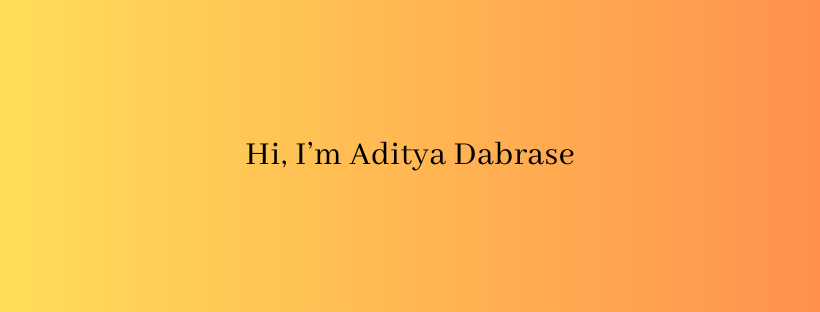

# Hi there! 

&nbsp;
&nbsp;
&nbsp;

As a Data Analyst, I successfully applied my skills in SQL, Tableau, Python, and IBM Cognos Analytics to deliver accurate and reliable insights for various business needs. I have demonstrated end-to-end ownership of Tableau dashboards, ensuring data quality, design, and utilization by cross-functional teams. I have also leveraged SQL scripting to verify and report data, addressing ad hoc requests swiftly and effectively.

I recently graduated from Humber College with a post-graduate degree in Business Insights and Analytics, where I learned new concepts relevant to data science. I am looking for a full-time role as a Data Scientist or Data Analyst, where I can contribute to the growth and success of the organization with my passion and expertise in the subjects.

## Hi there 👋
- 🔭 I’m currently working on building data science applications 
- 🌱 I’m currently learning Front end development
- 💬 Ask me about Data analytics, statistics, python and Tableau
- 📫 How to reach me: DM on LinkedIn or E-mail

<!--
**AdityaDabrase/AdityaDabrase** is a ✨ _special_ ✨ repository because its `README.md` (this file) appears on your GitHub profile.

Here are some ideas to get you started:

- 🔭 I’m currently working on ...
- 🌱 I’m currently learning ...
- 👯 I’m looking to collaborate on ...
- 🤔 I’m looking for help with ...
- 💬 Ask me about ...
- 📫 How to reach me: ...
- 😄 Pronouns: ...
- 👯 I’m looking to collaborate on anything creative!
- 🤔 I’m looking for help with iOS development
- ⚡ Fun fact: ...
-->
